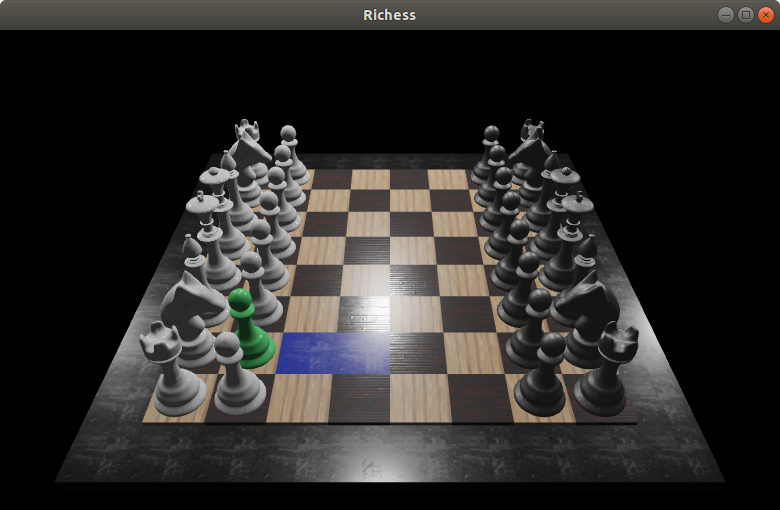

# Richess
Richers is a cross-platform 3D chess game. 
Application has been written in C++ language. 
OpenGL and GLFW libraries have been used. 

## Features

* Comfortable gameplay for two players.
* Full implementation of chess rules.
* Highlighting of possible movements.
* Manual camera rotation and zoom.
* Separated camera settings for each player.
* Three different levels of shadows quality.
* Light source orbit.

## Build instructions

* Clone the Richess game repository.
* Move into the `src` directory.
* Build the executable using `make` automation tool.
* Run Richess.
